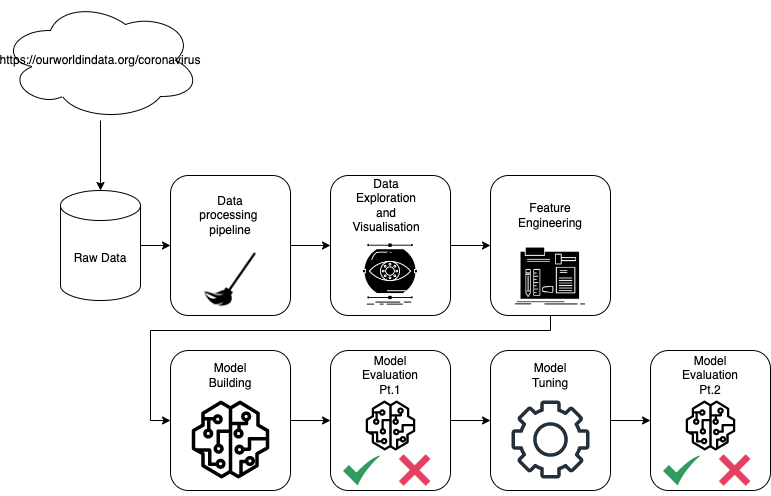

# The goal of this project is to develop a regression predictive models to predict the mortality rate of Covid-19 in Indonesia.

## Outline
### Data Collection
The dataset used in this project was from https://ourworldindata.org/coronavirus. It contained a total number of 55193 observations from countries all around the world. However, number of instances may increase due to the more data are being collected in the following years.

### An overview of the dataset
Columns | Non-missing value
--- | ---
iso_code | 55193 non-null  int64
continent | 55193 non-null  object
location | 55193 non-null  object
total_cases | 54633 non-null  float64
total_deaths | 46525 non-null  float64
new_cases | 54627 non-null  float64
new_deaths | 46525 non-null  float64
new_tests | 25792 non-null  float64
handwashing_facilities | 54003 non-null  float64
diabetes_prevalence | 54003 non-null  float64
median_age | 52833 non-null  float64
extreme_poverty | 36166 non-null float64

Here are some of the keys features. For more in-depth look, please refer to the notebook.

### System Architecture Overview

### Model Evaluation

