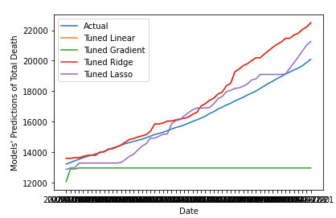
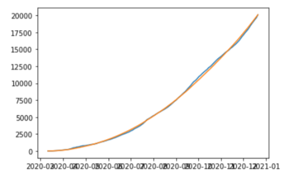
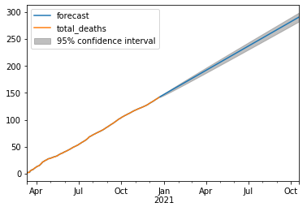

# The goal of this project is to develop regression predictive models to predict the mortality rate of Covid-19 in Indonesia.

## Outline
### Data Collection
The dataset used in this project was from https://ourworldindata.org/coronavirus. It contained a total number of 55193 observations from countries all around the world. However, number of instances may increase due to the more data are being collected in the following years.

### An overview of the dataset.
Columns | Non-missing value
--- | ---
iso_code | 55193 non-null  int64
continent | 55193 non-null  object
location | 55193 non-null  object
total_cases | 54633 non-null  float64
total_deaths | 46525 non-null  float64
new_cases | 54627 non-null  float64
new_deaths | 46525 non-null  float64
new_tests | 25792 non-null  float64
handwashing_facilities | 54003 non-null  float64
diabetes_prevalence | 54003 non-null  float64
median_age | 52833 non-null  float64
extreme_poverty | 36166 non-null float64

Here are some of the keys features. For more in-depth look, please refer to the notebook.

### System Architecture Overview.

The overview of the system design can be seen in the figure below.

As can be seen from the table in the dataset section, many columns contained missing values. It is important to deal with those missing values since it may hinder the training process of the models. Therefore, data were passed through the data processing pipeline before being fed into the model.

The data processing pipeline contains processes such as data cleaning, where missing values are either dropped or replaced by some other values. To understand deeper of the data presented, data exploration and visualisation were conducted. This process showed a lot of meaniful charts that helped in the decision making of the next phase. Afterwards, perhaps the most crucial part of the process was to draw out new feature(s) from existing features, this process is called the feature engineering phase. Finally, after all the previous steps were completed, the next steps was to develop the predictive model(s) and tune the models based on an preliminary evaluation. 

### Predictive Models Used.

The initial envisioned models used for this project were Linear Regression and Ridge regression. However, it became evident that more techniques could be utilised and experimented to see how different approaches compared to one another in terms of the performance accuracy.

The approach was adapted and rather than using only two machine learning models, additional models such as Gradient Boost Regression, Lasso Regression, and ARIMA Model(Time Series) were introduced. 

### Results

The results of each models' performance is visualised below. The first chart compares the prediction results with the ground thruth. One of the evaluation metric used in for measuring the model performance was Mean Sqaured Error. 

Model | MSE Score
--- | ---
**Linear** | 1519223
**Gradient** Boost | 18376429
**Ridge** | 1750438
**Lasso** | 1750439

### Note: The MSE scores were measured in unscaled data, which ranged from 0 to 20085.

A more accurate prediction was achieved through time-series analysis. This approach used ARIMA model, which is the combination of two models AR(Auto Regressive) and MA(Moving average).

Prediction of model's yhat and ground_truth

The forcasted total deaths from January 2021 to Oct 2021
### Note: The project was first developed in September 2020 and completed/stopped its developement in December 2020.

